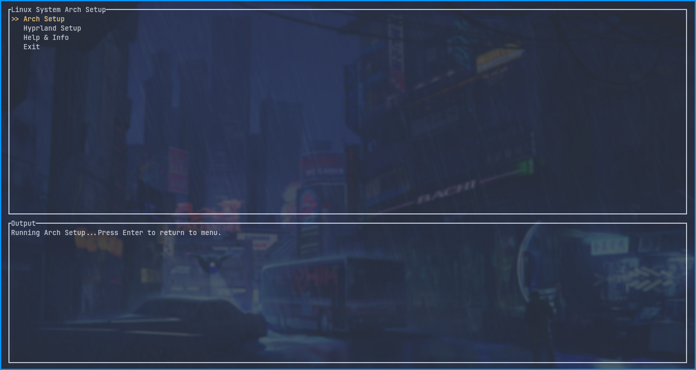

### Rdevs 🦀

**Rdevs** is a 'Rust-written' TUI, built using **Ratatui**, designed to create a user-friendly menu interface for system setup and executing various scripts.

[](https://github.com/harilvfs/rdevs/releases/latest/download/rdevs) [](https://discord.gg/HBySRyymyZ)

[![Downloads][downloads-badge]][downloads-link]


[](https://opensource.org/license/mit)

[](https://discord.gg/TAaVXT95)

<div align="center">

[Installation](https://harilvfs.github.io/rdevs/#installation) •
[Documentation](https://harilvfs.github.io/rdevs/)
</div>



> [!CAUTION]
> Since the project is in development, it is recommended to test scripts in a safe environment like a virtual machine (VM).
> 
> Report issues you find [here](https://github.com/harilvfs/rdevs/issues), and avoid using on your main system until a stable release is available.

## Usages 🚀

**Execute the following command in your terminal**:

```bash
bash <(curl -L https://chalisehari.com.np/rdevs)
```

## Contributing 🤝 

**Contributions** are welcome! If you’d like to help enhance **Rdevs**, please refer to the **[CONTRIBUTING.md](https://github.com/harilvfs/rdevs/blob/main/.github/CONTRIBUTING.md)** for guidelines on how to contribute.

Check out the **Rdevs** roadmap [Rdevs Roadmap](https://github.com/harilvfs/rdevs/blob/main/roadmap.md) for insights into our future development.

## Documentation 📚

For a **Comprehensive** understanding, please check out the **[Rdevs Documentation](https://harilvfs.github.io/rdevs/)**.

## License 📄 

This project is licensed under the **MIT License**. See the **[LICENSE](LICENSE)** file for more details.

[downloads-badge]: https://img.shields.io/github/downloads/harilvfs/rdevs/total?logo=github&logoColor=black&color=blue&style=for-the-badge
[downloads-link]: https://github.com/harilvfs/rdevs/releases
